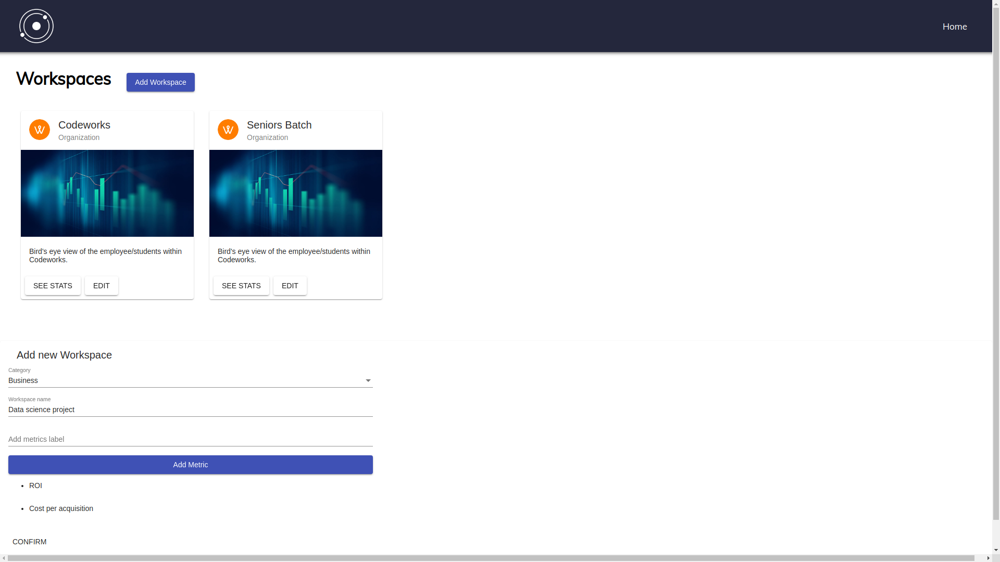
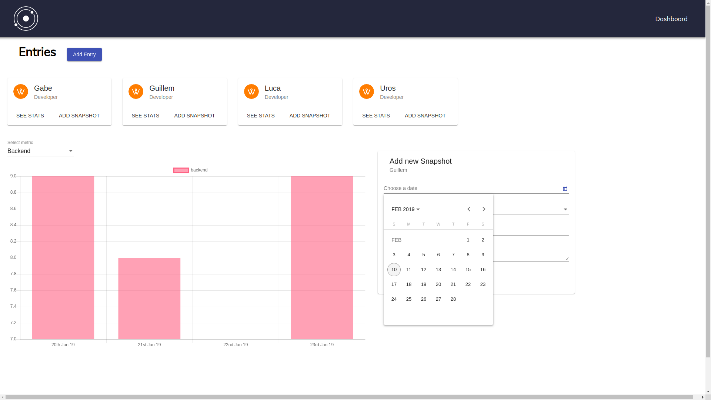

# Orbit

## What is Orbit?
Orbit-server is the back-end for [Orbit](https://github.com/LucaPanzavolta/Orbit-FE) , an open-source data visualisation tool that allows businesses, sports teams and educational institutions track, measure and improve performance. Built using cutting-edge technologies, Orbit provides a birds-eye-view on performance metrics in a way that is easy to understand and digest. Students, players and employees are presented with key changes they can make to improve the performance through a complex neural networks, helping users focus their time more effectively and efficiently.

## Tech Stack

### Front-end: [Orbit-FE](https://github.com/LucaPanzavolta/Orbit-FE)
* [Angular](https://angular.io/)
* [RxJS](https://rxjs-dev.firebaseapp.com/)
* [Chart.js](https://www.chartjs.org/)
* [Angular Material](https://material.angular.io/)

### Back-end

* [Node.js](https://nodejs.org/en/)
* [Koa](https://koajs.com/)
* [MongoDB](https://www.mongodb.com/)
* [Mongoose](https://mongoosejs.com/)
* [Heroku](https://www.heroku.com/)

## Screenshots




# Getting started
After cloning the repo you'll have to install the dependencies with:

`npm install`

## Database setup

### 1. You use an online database

In this case you should: 

* Create a free account at [mLab](https://mlab.com/) 
* Create a `.env` file containing: 

```javascript
DB_USERNAME=YOUR_DB_USERNAME
DB_PASSWORD=YOUR_DB_PASSWORD
DB_HOST=YOUR_DB_HOST
DB_PORT=YOUR_DB_PORT
DB_NAME=YOUR_DB_NAME
```

### Connet to Database

In the shell type:

 `$mongo YOUR_DB_HOST.mlab.com:YOUR_DB_PORT/YOUR_DB_NAME -u YOUR_DB_USERNAME -p YOUR_DB_PASSWORD`


### 2. You can use your local database

In this case you should:

* In the `db.js`-file uncomment the section marked as 'LOCAL DATABASE' and comment out the section marked 'ONLINE DATABASE'

### Connet to Database

In the shell type:

* `$mongod`
* `$mongo`       (In another tab)


## Start the server

In the shell type:

`$npm start`

**Happy hacking!!**


## Use Postman for HTTP requests

Use this link to get all requests: [Orbit end-points](https://www.getpostman.com/collections/ac2fd74513927f01fa8f).

Don't forget to create a new Environment (http://localhost:3000).

## Contributors
* Luca Panzavolta - [LucaPanzavolta](https://github.com/LucaPanzavolta) - [Linkedin](https://www.linkedin.com/in/lucapanzavolta)
* Uros C - [ross-u](https://github.com/ross-u) - [Linkedin](https://www.linkedin.com/in/uros-cirkovic)
* Based on a fork from [cjjenkinson](https://github.com/cjjenkinson)

As this is a 100% open source project all contributions and pull requests will be highly welcomed!


